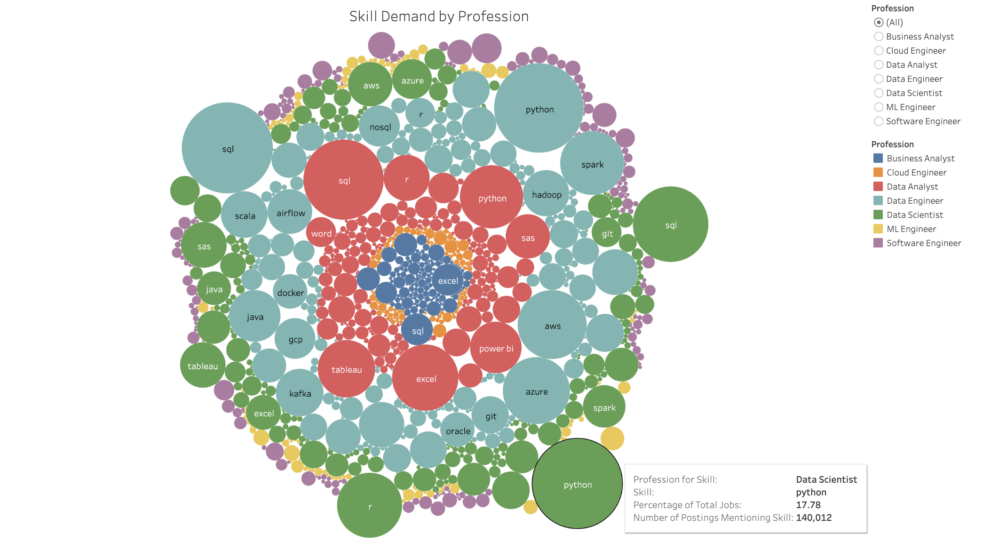
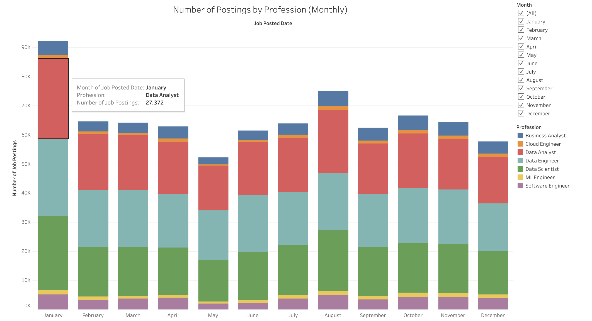
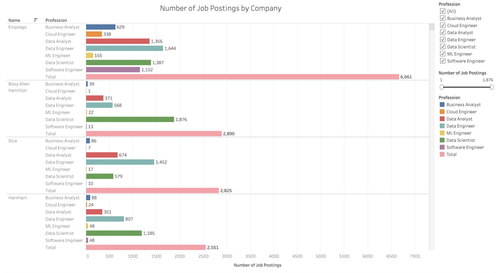
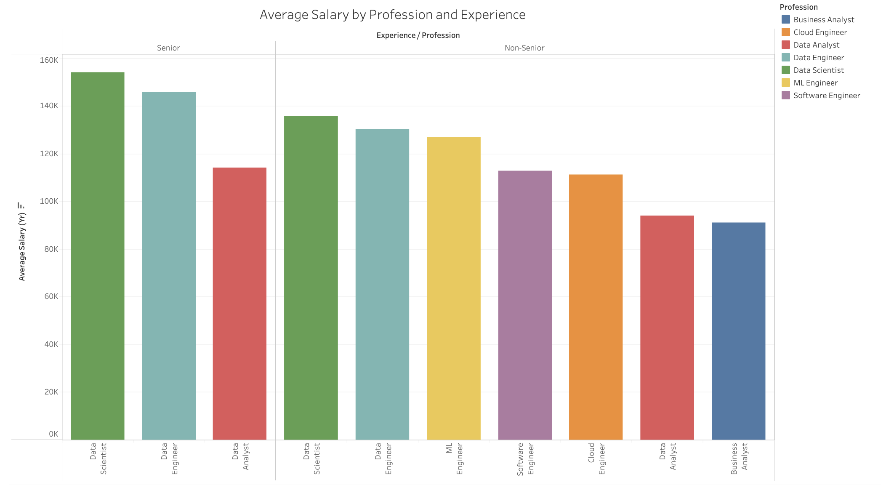

# Job Postings Data Analysis using SQL
## Introduction

📊 Dive into the data job market! Focusing on data scientist roles, this project explores 💰 top-paying jobs, 🔥 in-demand skills, and 📈 where high demand meets high salary in the Data Science field.

## Background
Driven by a quest to navigate the data science job market more effectively, this project was born from a desire to pinpoint top-paid and in-demand skills, streamlining others work to find optimal jobs.

The data used for this project packed with insights on job titles, salaries, locations, and essential skills.

**The first five queries below investigate the timing of job postings and the specific aspects about the data scientist job market:**
1. Which months have the highest amount of job postings?
2. How do the number of job postings vary throughout the day? (Focusing on the EST Zone in the United States)
3. What are the top ten in demand skills for data scientists (remote or New York roles)?
4. What are the most common skills for the top 100 highest-paying salaries (on average) Data Scientist roles that are located remotely or in New York?
5. Which companies had the most job postings for Data Scientist roles?


**In the last five queries below, the insight becomes visualized through Tableau on a beautiful dashboard.**
1. What are the most in-demand skills for each profession?
2. How many job postings were posted each month for each profession?
3. How many jobs were posted for each company for each profession?
4. How many job postings were posted in each country? Show the top 10 countries with the most job postings.
5. What is the average salary for each profession and senior profession?

[View the Tableau Dashboard by right clicking this link to open it in a new tab](https://public.tableau.com/views/JobPostingsDataAnalysis2023/JobPostingDataAnalysis2023?:language=en-US&:sid=&:redirect=auth&:display_count=n&:origin=viz_share_link)

The visuals in The Analysis: Part 2 are hyperlinked, so right click and open them in a new tab for the interactive part!

## Tools I Used
For my deep dive into the data analyst job market, I harnessed the power of several key tools:

* **SQL**: The programming language that allows me to query the database and reveal insights.<br>
* **PostgreSQL**: The database management system that handles the job posting data with over 750,000 unique job postings.<br>
* **Visual Studio Code**: The IDE used to connect to the PostgreSQL and execute SQL queries.<br>
* **Tableau Desktop & Tableau Public**: Enabled connection to the PostgreSQL database to provide beautiful visuals that further tell the story of the data.<br>
* **Git & GitHub**: Essential for version control and sharing my SQL scripts and analysis, ensuring collaboration and project tracking.<br>


## The Analysis: Part 1

### 1. Monthly Trends in Job Postings
Which months have the highest amount of job postings?<br>

This SQL query retrieves the number of job postings for each month from the `job_postings_fact` table. It uses the TO_CHAR function to extract the month from the `job_posted_date` 
column and then counts the occurrences of job postings (`job_id`) for each month. The results are grouped by the month and ordered in descending order of the number of job postings.

```sql
SELECT 
    TO_CHAR(job_posted_date, 'Month') AS month,
    COUNT(job_id) as number_of_job_postings
FROM job_postings_fact
GROUP BY month
ORDER BY number_of_job_postings DESC;
```
#### Results:
* **January** has the highest number of job postings, with 92,266.
* **August** and **October** also show high activity, with over 66,000 job postings each.
* The lowest number of job postings occurs in **May** with 52,235.<br>


| Month     | # of Job Postings |
|-----------|-------------------|
| January   | 92,266            |
| August    | 75,067            |
| October   | 66,601            |
| February  | 64,560            |
| November  | 64,404            |
| March     | 64,158            |
| July      | 63,855            |
| April     | 62,915            |
| September | 62,433            |
| June      | 61,500            |
| December  | 57,692            |
| May       | 52,235            |

#### Key Insights:
Overall, the best month to apply for jobs is January. This could be attributed to:
 * **New Year Hiring Plans**: Many companies reset their budgets and hiring plans at the start of the year. After the holiday season, organizations often start posting jobs for the upcoming year's projects and initiatives.
 * **End of Holiday Hiring Freeze**: Some companies slow down or freeze hiring during December due to the holiday season. Once the new year begins, they resume hiring, resulting in a surge in job postings.


### 2. Daily Variations in Job Postings
How do the number of job postings vary throughout the day? (Focusing on the EST Zone in the United States)<br>

This query analyzes job postings from the `job_postings_fact` table in the United States Eastern Standard Time (EST) zone. I create a CTE (`datetime_cte`) to convert `job_posted_date` to Eastern Standard Time (EST) and extract the time. I then use a `CASE` statement to classify job postings into distinct time periods, such as 'midnight', 'morning', 'afternoon', etc., based on the job posting time (`cte.time`). I filter the job postings based on specific Eastern U.S. states, and the results are grouped by `time_of_day` and ordered in ascending order.
```sql
WITH datetime_cte AS(
    SELECT
        job_id,
        job_posted_date,
        job_posted_date::date as date,
        (job_posted_date AT TIME ZONE 'UTC' AT TIME ZONE 'America/New_York')::timestamptz::TIME AS time
    FROM job_postings_fact
    WHERE job_country = 'United States'
)

SELECT
    COUNT(j.job_id) as number_of_job_postings,
    CASE
        WHEN cte.time >= '00:00' AND cte.time < '03:00' THEN '1_midnight'
        WHEN cte.time >= '03:00' AND cte.time < '06:00' THEN '2_midnight/early-morning'
        WHEN cte.time >= '06:00' AND cte.time < '09:00' THEN '3_early-morning'
        WHEN cte.time >= '09:00' AND cte.time < '12:00' THEN '4_morning'
        WHEN cte.time >= '12:00' AND cte.time < '15:00' THEN '5_afternoon'
        WHEN cte.time >= '15:00' AND cte.time < '18:00' THEN '6_evening'
        WHEN cte.time >= '18:00' AND cte.time < '21:00' THEN '7_night'
        ELSE '8_late-night'
    END as time_of_day
FROM job_postings_fact as j
JOIN datetime_cte as cte USING (job_id)
WHERE job_location LIKE '%, ME%' OR job_location LIKE '%, MD%' OR job_location LIKE '%, MA%' OR job_location LIKE '%, NH%' OR job_location LIKE '%, NJ%' OR job_location LIKE '%, NY%' OR job_location LIKE '%, CT%' OR job_location LIKE '%, DE%' OR job_location LIKE '%, GA%' OR job_location LIKE '%, NC%' OR job_location LIKE '%, VT%' OR job_location LIKE '%, VA%' OR job_location LIKE '%, WV%' OR job_location LIKE '%, OH%' OR job_location LIKE '%, PA%' OR job_location LIKE '%, RI%' OR job_location LIKE '%, SC%' OR job_location LIKE '%, MI%' OR job_location LIKE '%, TN%' OR job_location LIKE '%, FL%' OR job_location LIKE '%, IN%' OR job_location LIKE '%, KY%'
GROUP BY time_of_day
ORDER BY time_of_day ASC;
```
#### Results:
* Job postings are heavily concentrated during traditional U.S. business hours, but there is still considerable activity in the early morning and evening periods.
* The night and late-night hours have the lowest job postings at 4,257 and 5,530, respectively, likely due to fewer recruiters working during these hours and reliance on automated systems.
* This analysis highlights job posting trends throughout the day, providing valuable insights for employers and job seekers in EST.

| # of Job Postings | Time of Day             |
|:-----------------:|:-----------------------:|
| 5530              | midnight                |
| 13542             | midnight/early-morning  |
| 13198             | early-morning           |
| 13004             | morning                 |
| 14607             | afternoon               |
| 11273             | evening                 |
| 12960             | night                   |
| 4257              | late-night              |


### 3. In-Demand Skills for Data Scientists
What are the top ten in-demand skills for data scientists (remote or New York roles)?<br>

This SQL query retrieves the top 10 skills for Data Scientist roles in New York, NY, along with their average salaries. It counts job postings for each skill, filters for positions with salary data, and groups results by skill and skill type. The output is ordered by the number job postings and average salary, limiting results to the top 10 skills.

```sql
SELECT
    COUNT(j.job_id) AS skill_count,
    s.skills AS skill,
    ROUND(AVG(j.salary_year_avg),0) as average_salary_avg,
    s.type as skill_type
FROM job_postings_fact AS j
JOIN skills_job_dim AS sj USING (job_id)
JOIN skills_dim AS s USING (skill_id)
WHERE 
    profession = 'Data Scientist'
    AND j.job_location IN ('New York, NY')
    AND salary_year_avg IS NOT NULL
GROUP BY s.skills, skill_type
ORDER BY skill_count DESC, average_salary_avg DESC
LIMIT 10;
```
#### Results:
The most in-demand skills for Data Scientist roles in remote or New York locations are dominated by programming languages (Python, SQL, R) and machine learning libraries (pandas, PyTorch, TensorFlow). Cloud skills like AWS and big data tools such as Spark are also highly valued, offering some of the highest salaries. Tools like Tableau and Excel are important but less in demand.

| Skill Count | Skill      | Average Salary | Skill Type       |
|-------------|------------|----------------|------------------|
| 292         | Python     | 161,120        | Programming      |
| 224         | SQL        | 160,002        | Programming      |
| 169         | R          | 156,270        | Programming      |
| 63          | AWS        | 156,096        | Cloud            |
| 59          | Tableau    | 131,988        | Analyst Tools    |
| 45          | Spark      | 171,372        | Libraries        |
| 37          | Pandas     | 138,962        | Libraries        |
| 34          | PyTorch    | 172,756        | Libraries        |
| 30          | TensorFlow | 154,162        | Libraries        |
| 29          | Excel      | 144,646        | Analyst Tools    |


### 4.Common Skills Among High-Paying Data Scientist Roles
What are the most common skills for the top 100 highest-paying salaries (on average) Data Scientist roles that are located remotely or in New York?<br>

This SQL query identifies the top 100 highest-paying Data Scientist roles in the United States, specifically focusing on positions located in New York or labeled as 'Anywhere'. 

I first create the CTE `top_100_highest_paying` to retrieve the top 100 highest paying Data Scientist job postings. The main query then counts the number of job postings associated with each skill from the top 100 CTE. I join with the `skills_job_dim` and `skills_dim` tables to gather skills and their types, grouping the results by skill and skill type. The results are ordered by the number of job postings and limited to the top 5 skills.

```sql
WITH top_100_highest_paying AS(
    SELECT
        job_id as job_id,
        job_title as job_title,
        ROUND(salary_year_avg,0) as salary_avg,
        job_location
    FROM job_postings_fact
    WHERE
        profession = 'Data Scientist'
        AND job_country = 'United States'
        AND (job_location = 'Anywhere' OR job_location LIKE '%NY%')
        AND salary_year_avg IS NOT NULL
    ORDER BY salary_avg DESC
    LIMIT 100
)

SELECT
    COUNT(cte.job_id) as number_of_job_postings,
    s.skills as skill,
    s.type as skill_type
FROM top_100_highest_paying as cte
JOIN skills_job_dim USING (job_id)
JOIN skills_dim as s USING (skill_id)
GROUP BY skill, skill_type
ORDER BY number_of_job_postings DESC
LIMIT 5;
```
#### Results:
The top five most common skills are:<br>
| Skill   | % of Top 100 Jobs |
|:-------:|:-----------------:|
| Python  | 77%               |
| SQL     | 55%               |
| R**     | 35%               |
| Spark   | 22%               |
| Tableau | 16%               |


### 5. Leading Companies in Data Scientist Job Postings
Which companies had the most job postings for Data Scientist roles? <br>

This SQL query retrieves the top 10 companies that had the most amount of Data Scientist job postings for the year 2023. I joined the `job_postings_fact` table with the `company_dim` table using the `comapny_id` foreign key to obtain the companies' name.

```sql
SELECT 
    c.name as company,
    COUNT(j.job_id) as number_of_job_postings
FROM job_postings_fact as j
JOIN company_dim as c
USING (company_id)
WHERE profession = 'Data Scientist'
GROUP BY c.name
ORDER BY number_of_job_postings DESC
LIMIT 10;
```
#### Results:
The top ten companies are: **Booz Allen Hamilton**, **Emprego**, **Walmart**, **Guidehouse**, **Harnham**, **SynergisticIT**, **Upwork**, **Deloitte**, **Leidos**, and **Dice**.

| Company                 | # of Job Postings |
|-------------------------|-------------------|
| Booz Allen Hamilton     | 1,876             |
| Emprego                 | 1,387             |
| Walmart                 | 1,330             |
| Guidehouse              | 1,24              |
| Harnham                 | 1,185             |
| SynergisticIT           | 1,031             |
| Upwork                  | 857               |
| Deloitte                | 705               |
| Leidos                  | 648               |
| Dice                    | 579               |


## The Analysis: Part 2

### 1. Identifying the Most In-Demand Skills for Each Profession.
What are the most in-demand skills for each profession?<br>

This SQL query counts the number of job postings for each profession and skill, calculates the percentage of total job postings for each skill, and orders the results by the number of postings. I create a CTE `total_count_cte` to count the total number of job postings for the `percentage_of_total_jobs` column to calculate the number of job posting mentioned a skill (grouped by profession) over the total amount of job postings (regardless of profession). I also joined the `skills_job_dim`, `skills_dim` and `total_count_cte` tables for this analysis. The results are limited to the percentage of job postings mentioning the skill for a given profession being greater than 5%.<br>

I also created a Custom Query in Tableau using the SQL query below to create the packed bubbles visual. This was extremely in facilitating the filters and configuration of the packed bubbles visual in Tableau.

```sql
WITH total_count_cte AS (
    SELECT
        COUNT(job_id) AS total_count
    FROM job_postings_fact
)


SELECT
    j.profession as profession,
    COUNT(j.job_id) AS skill_count,
    s.skills AS skill,
    s.type as skill_type,
    ROUND(((COUNT(j.job_id) * 1.0 / cte.total_count) * 100),4) AS percentage_of_total_jobs
FROM job_postings_fact AS j
JOIN skills_job_dim AS sj USING (job_id)
JOIN skills_dim AS s USING (skill_id)
JOIN total_count_cte AS cte ON 1=1
GROUP BY profession, s.skills, skill_type, cte.total_count
HAVING ROUND(((COUNT(j.job_id) * 1.0 / cte.total_count) * 100),4) >= 5
ORDER BY skill_count DESC;
```
#### Results
[](https://public.tableau.com/views/JobPostingsDataAnalysis2023/SkillDemandbyProfession?:language=en-US&:sid=&:redirect=auth&:display_count=n&:origin=viz_share_link)
- SQL and Python are the top required skills across professions, especially for Data Engineers and Data Scientists.
- Cloud skills like AWS and Azure are highly relevant for Data Engineers.
- Analyst tools like Excel, Tableau, and Power BI are more common for Data Analysts.
- Skills like Spark and Java are also significant for Data Engineers but less so for other professions.
- Because Business Analyst (6.24%), Cloud Engineer (1.57%), and Machine Learning Engineer (1.79%) professions compromise less than 10% of the job postings, the top skills for those professions are not in the results.

| Profession      | Skill Count | Skill     | Skill Type       | % of Total Jobs |
|-----------------|-------------|-----------|------------------|-----------------|
| Data Engineer   | 142062      | sql       | programming      | 18.0354%        |
| Data Scientist  | 140012      | python    | programming      | 17.7751%        |
| Data Engineer   | 137245      | python    | programming      | 17.4238%        |
| Data Analyst    | 110380      | sql       | programming      | 14.0132%        |
| Data Scientist  | 97835       | sql       | programming      | 12.4206%        |
| Data Engineer   | 81578       | aws       | cloud            | 10.3567%        |
| Data Engineer   | 77054       | azure     | cloud            | 9.7823%         |
| Data Analyst    | 75348       | excel     | analyst_tools    | 9.5657%         |
| Data Scientist  | 72526       | r         | programming      | 9.2075%         |
| Data Engineer   | 69905       | spark     | libraries        | 8.8747%         |
| Data Analyst    | 68409       | python    | programming      | 8.6848%         |
| Data Analyst    | 56569       | tableau   | analyst_tools    | 7.1817%         |
| Data Engineer   | 45814       | java      | programming      | 5.8163%         |
| Data Analyst    | 45482       | power bi  | analyst_tools    | 5.7741%         |

________________________________________________________________________________________________________________________
### 2. Analyzing Monthly Job Postings for Each Profession
How many job postings were posted each month for each profession?<br>

This SQL query counts the number of job postings for each profession, grouped by month. I used the TO_CHAR function to format the `job_posted_date` to display the full name of the month. I also used EXTRACT function to extract the month number for grouping. The results are ordered by profession, allowing for a clear overview of monthly hiring trends across different professions.

```sql
SELECT 
    TO_CHAR(job_posted_date, 'Month') AS month,
    COUNT(job_id) as number_of_job_postings,
    profession as profession,
    EXTRACT(MONTH FROM job_posted_date) AS month_number
FROM job_postings_fact
GROUP BY month_number, month, profession
ORDER BY profession;
```
#### Results
[](https://public.tableau.com/views/JobPostingsDataAnalysis2023/NumberofPostingsbyProfessionMonthly?:language=en-US&:sid=&:redirect=auth&:display_count=n&:origin=viz_share_link)
Overall, the data indicates a robust demand for Data Analytic, Data Engineering, and Data Science roles. As discussed earlier, January has the highest amount of postings.

| Month      | # of Job Postings | Profession                | Month Number |
|------------|-------------------|---------------------------|--------------|
| January    | 4881              | Business Analyst          | 1            |
| ...        | ...               | ...                       | ...          |
| December   | 4126              | Business Analyst          | 12           |
| January    | 1300              | Cloud Engineer            | 1            |
| ...        | ...               | ...                       | ...          |
| December   | 1154              | Cloud Engineer            | 12           |
| January    | 27372             | Data Analyst              | 1            |
| ...        | ...               | ...                       | ...          |
| December   | 15889             | Data Analyst              | 12           |
| January    | 26633             | Data Engineer             | 1            |
| ...        | ...               | ...                       | ...          |
| December   | 16524             | Data Engineer             | 12           |
| January    | 25542             | Data Scientist            | 1            |
| ...        | ...               | ...                       | ...          |
| December   | 14861             | Data Scientist            | 12           |
| January    | 1405              | Machine Learning Engineer | 1            |
| ...        | ...               | ...                       | ...          |
| December   | 1260              | Machine Learning Engineer | 12           |
| January    | 5133              | Software Engineer         | 1            |
| ...        | ...               | ...                       | ...          |
| December   | 3878              | Software Engineer         | 12           |
________________________________________________________________________________________________________________________
### 3. Examining Job Postings by Company for Each Profession
How many jobs were posted for each company for each profession?<br>

This SQL query retrieves the number of job postings for each profession by company. I order results in descending order based on the count of job postings, highlighting the companies with the highest number of job listings per profession.
```sql
SELECT
    c.name as company,
    j.profession as profession,
    COUNT(j.job_id) as number_of_job_postings
FROM job_postings_fact as j
JOIN company_dim AS c USING (company_id)
GROUP BY name, profession
ORDER BY number_of_job_postings DESC;
```
#### Results
The top 3 companies that are hiring are Emprego, Booz Allen Hamilton, and Dice. There are 140033 companies, so scroll away!

________________________________________________________________________________________________________________________
### 4. Investigating Job Postings by Country, Highlighting the Top 10 Countries with the Most Job Postings
How many job postings were posted in each country? Show the top 10 countries with the most job postings.<br>

This SQL query retrieves the total number of job postings grouped by country from the `job_postings_fact` table. It counts the number of job postings and groups the count by country. I order the results in descending order based on the number of job postings and limit the output to the top 10 countries with the highest number of job postings.
```sql
SELECT
    COUNT(job_id) as number_of_job_postings,
    job_country
FROM job_postings_fact
GROUP BY job_country 
ORDER BY number_of_job_postings DESC
LIMIT 10;
```

#### Results
[](https://public.tableau.com/views/JobPostingsDataAnalysis2023/JobPostingsAroundtheWorld?:language=en-US&:sid=&:redirect=auth&:display_count=n&:origin=viz_share_link)

The top 10 countries with the most job postings are:
| Country            | # of Job Postings |
|--------------------|-------------------|
| United States      | 206943            |
| India              | 51197             |
| United Kingdom     | 40439             |
| France             | 40028             |
| Germany            | 27782             |
| Spain              | 25123             |
| Singapore          | 23702             |
| Sudan              | 21519             |
| Netherlands        | 20673             |
| Italy              | 17073             |

Australia, South America, and Antartica did not make the list.
________________________________________________________________________________________________________________________
### 5. Calculating the Average Salary for Each Profession and Senior Profession
What is the average salary for each profession and senior profession?<br>

This SQL query calculates the average annual salary for each profession listed in the `job_postings_fact` table. I filter out records with null salary values, group the results by `job_title_short` (which represents the profession), and round the average salaries to the nearest whole number. Finally, I order the results by the average salary in descending order.

```sql
SELECT
    job_title_short as profession,
    ROUND(AVG(salary_year_avg),0) as average_salary_avg
FROM job_postings_fact
WHERE salary_year_avg IS NOT NULL
GROUP BY job_title_short
ORDER BY average_salary_avg DESC
```

#### Results
[](https://public.tableau.com/views/JobPostingsDataAnalysis2023/AverageSalarybyProfessionandExperience?:language=en-US&:sid=&:redirect=auth&:display_count=n&:origin=viz_share_link)

This indicates a clear salary progression from non-senior roles to more senior technical positions. Senior Data Scientist and Senior Data Engineering job postings have the highest average salaries ($154,050 and 145,867 respectively). Data Analyst and Business Analysts have the lowest average salaries ($93,876 and $91,071 respectively). However, salary progression is evident from a Data Analyst position to Senior Data Analyst position with a 21.54% increase in average salary.

| Profession                 | Average Salary Avg ($) |
|----------------------------|------------------------|
| Senior Data Scientist      | 154,050                |
| Senior Data Engineer       | 145,867                |
| Data Scientist             | 135,929                |
| Data Engineer              | 130,267                |
| Machine Learning Engineer  | 126,786                |
| Senior Data Analyst        | 114,104                |
| Software Engineer          | 112,778                |
| Cloud Engineer             | 111,268                |
| Data Analyst               | 93,876                 |
| Business Analyst           | 91,071                 |


## What I Learned
Throughout this project, I've turbocharged my SQL toolbox:

🧩 Complex Query Crafting: Mastered advanced SQL, merging tables, creating CTE's using WITH clauses for out of this world calculations, and using functions like TO_CHAR() and EXTRACT() to gain insight on dates.
📊 Data Aggregation: Got cozy with GROUP BY and HAVING and incorporated aggregate functions like COUNT() and AVG().
💡 Analytical Wizardry: Leveled up my real-world puzzle-solving skills, turning questions into actionable, insightful SQL queries.

## Conclusion

Here are some key insights drawn from the analysis of the job postings data, focusing on trends, skill demands, and hiring activity:

**1. Top Skills for Data Scientist Roles in New York:**<br>
Python and SQL are the most in-demand skills for Data Scientist roles, reflecting their central importance in data manipulation and analysis.
R, AWS, and Spark are also highly sought-after, highlighting the need for cloud computing and big data management expertise.
Machine learning libraries such as PyTorch and TensorFlow are key to high-paying jobs, reflecting the increasing demand for AI-driven solutions.<br>
**2. High-Paying Data Scientist Jobs – Common Skills:**<br>
Among the top 100 highest-paying Data Scientist jobs, Python is required in 77% of roles, with SQL and R following at 55% and 35%, respectively.
The presence of Spark and Tableau in high-paying roles shows the importance of both big data processing and visualization tools.<br>
**3. In-Demand Skills Across Professions:**<br>
SQL and Python dominate the job market for data professionals, including Data Engineers, Data Analysts, and Data Scientists.
For Data Engineers, AWS, Azure, and Spark are crucial skills, indicating the importance of cloud platforms and big data tools.
For Data Analysts, Excel, Tableau, and Power BI are widely demanded, reflecting the need for visualization and reporting skills.<br>
**4. Monthly Job Posting Trends by Profession:**<br>
Across all professions, January is the busiest hiring month, with Data Analysts and Data Engineers showing the highest levels of job postings.
December tends to see a dip in job postings, likely due to the holiday season and end-of-year slowdowns in hiring.<br>
**5. Hiring by Companies for Each Profession:**<br>
Emprego, Booz Allen Hamilton, and Dice emerge as the top hiring companies, offering a broad range of job postings across professions.
The high number of postings from these companies indicates their large-scale recruitment needs, possibly driven by multiple projects or client engagements.
These insights can guide both job seekers and employers in understanding the dynamics of the job market, particularly for data-centric roles. They also shed light on when and where hiring activity is most concentrated, as well as which skills are most critical to securing high-paying positions.
